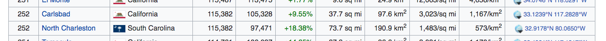

# Policy Analysis

Tens of thousands of local governments produce text that decrees how they function. How are these documents structured, how are the similar, and how do they differ? The particular focus here, purely because of their current public and political enthusiasm, are the cases of 
	1) Coronavirus-19 response and 
	2) Police conduct.

# Table-ish of Contents

- [Counties](#counties)
- [Cities](#cities)
- [Targets](#targets)
- [Content](#content)
- [Acquisition](#acquisition)
- [Conversion](#conversion)
- [Interpretation](#interpretation)
- [Surveying](#surveying)
- [Analysis](#analysis)


## Counties

COVID-19 County Variance Attestation Form: https://www.cdph.ca.gov/Programs/CID/DCDC/Pages/COVID-19/County_Variance_Attestation_Form.aspx

The fill-ins are manual and hilarious. Collect them and displaty by county. Just make the download list manually.

## Cities

The list of cities comes from https://en.wikipedia.org/wiki/List_of_United_States_cities_by_population

Oddly enough, there is a tie @ 252. The default sorting yields the tie, presumably because the 2019 Estimate is exactly the same (what are the odds of that)? 


However, if you specify to sort by 2019 Estimate, it actually does separate them:



This complicated immediate reformatting but no worries. Saved to _cities.tsv_ (preferred as a delimiter over CSV because of the rampant use of commas)

## Targets

Starting with Cleveland, the terminology seems to be 
	- Manual
	- Rules
	- Conduct
	- Discipline

Let's verify: 

`manual rules conduct discipline Cleveland Ohio filetype:pdf`

Correct on the first hit. But we should probably add 'police' -- let's try with a new city.

`police manual rules conduct discipline Fort Collins Colorado filetype:pdf`

Yields https://www.fcgov.com/police/pdf/policy_manual.pdf as the first link. Yes, seems to be essentially the correct document. The assumption is that any large police force will have, as the first hit, this sort of document.


## Content

What is actually in these documents? The hypothesis is that there's going to be a lot of overlap. Actually, that would be ideal. The question we're facing currently is as to the prescribed procedures across various police forces in different cities, different populations, etc. In fact, one hallmark of this kind of analysis is to understand what language is used and how that language differs. 

In the context of understanding police activity, it is no great leap of imagination to understand that there are bad actors, as there are in any group. People are weird and do weird things; that's a sociological inquiry they pay people lots of money to go to school to learn about, so I'd refer dear reader to them, though do let me know what you find out because I am genuinely curious. But that isn't quite the focus here. 

I start by taking any police officer as simply a manifestation of what any representative of any organization should be doing, which is simply enacting the code under which you are sworn into duty. I just the codes might be silly enough to be interesting, but we'll find out.

## Acquisition

This is a classic scraping situation, but I really hate that word. It implies undirected search, which is, unfortunately, at times, useful. 

But here we have `wc -l resources/cities.tsv` (316) although they are numbered 1 to 317 because of the aformentioned tie, which is obnoxious, but the scale of this job is such that I can spend time kvetching about it in a Readme than actually doing any actual flexible ETL to get over the problem, so it's my pleasure.

Be nice to Google, and they'll be nice to you. Make it simple.

```python
import requests
from fake_useragent import UserAgent
from bs4 import BeautifulSoup

ua = UserAgent()
number_result = 1
query = 'police manual rules conduct discipline Fort Collins Colorado filetype:pdf'

google_url = 'https://www.google.com/search?q=' + query + '&num=' + str(number_result)
response = requests.get(google_url, {'User-Agent': ua.random})
soup = BeautifulSoup(response.text, 'html.parser')
```

You just need this div:

`target_div = soup.find('a', attrs = {'data-uch': '1'})`

And the link:

`target_link = target_div.attrs['href']`

yields `'/url?q=https://www.fcgov.com/police/pdf/policy_manual.pdf&sa=U&ved=2ahUKEwjx15qZ1OvpAhWCjp4KHTt1AAgQFjAAegQIABAB&usg=AOvVaw0f-ToEX8HZ3jO7SQhqCBdS'`. 

First of all, I've always found BeautifulSoup to be pretty poorly implemented; for example, `target_div.href` which should *not* work actually just returns `None` - you access attributes via `.attrs` which seems kind of lazy to me, but whatever.

Secondly, ugh, now we have to format this stupid thing becauase Google wants to track our every move. The regex should be simple. This absurd construction is one of my favorites, and I've spent many minutes trying in vain to come up with one not so ridiculous, but:

`target_link = re.search(r'q=([^\&]+)',target_link).groups()[0]`

Gives us, finally, https://www.fcgov.com/police/pdf/policy_manual.pdf. Yes, I reuse variables (across type), get over it.

`record = ` 

Now this record is either something correct or something incorrect. Once we download all of them, we can probably pick out the outliers, but let's try our best to get as many as we can for now.

## Conversion

Classically, `pdftotext` -- great command line tool but also has a python wrapper. And the reason I hate developing on a Mac:

```zsh
➜  ~ uname -a
Darwin Selwyn-Lloyds-MacBook-Pro.local 17.7.0 Darwin Kernel Version 17.7.0: Thu Jun 21 22:53:14 PDT 2018; root:xnu-4570.71.2~1/RELEASE_X86_64 x86_64
```

Of course I have the program:

```zsh
➜  ~ pdftotext
pdftotext version 3.03
Copyright 1996-2011 Glyph & Cog, LLC
Usage: pdftotext [options] <PDF-file> [<text-file>]
```

And yet, pip fails due to missing dependancy, Poppler (https://poppler.freedesktop.org/).

```zsh
brew install poppler
```

But of course don't forget `pkg-config`! This would have been an obviosu standard on a \*nix machine, so you'd not tend to remember it's a dependency.

Actually, if you mess it up at first, you need to re-link, with `--overwrite`:

```zsh
brew install pkg-config
brew link --overwrite poppler
```

So you can eventually perform

```zsh
pip install pdftotext
```

Annnnd then

```python
import pdftotext
```

Again, could have gotten around this with `subprocess` but. . .


Poppler is a great library for PDF import / export, which is actually not a trivial matter, but ugh. I could use `subprocess` which is almost always a great option, but to be _Pythonic_ let's `brew install poppler`, `pip install pdftotext`

```python
import pdftotxt

```

## Interpretation

A lot of the conversation on grabbing data from PDFs is focused on extracting information from tables, usually with `tabula-py`, because it is an important problem and a great source of 'trapped' data. That's beyond the scope here because we generally benefit from expecting these documents to be, basically, just text. 


## Surveying

We can check out a few of these documents by hand, but with 300+, we need to get a survey of what we've got. Some of the downloads will fail. That's fine. Some of them will download. . . something. . . that may or may not be what we're looking for. Hopefully, a significant number will be documents in the target group -- essentially, codes for police activity. 

The misses are missed gracefully. Presumably there are some hits that. . . aren't quite right. What kind of metrics can we use to identify what we've got?

- Number of success and failures (and why)
- Length

## Analysis

This is in part in aid of the above, Surveying. There have got to be some pretty common words. Good targets should share a large number of these phrases, and the *most interesting* ones will be those that share those phrases but have unique phrases within them.

That's [tl;dr;what;you;callit]


```python
links = []
titles = []
descriptions = []
for r in result_div:
    # Checks if each element is present, else, raise exception
    try:
        link = r.find('a', href = True)
        title = r.find('div', attrs={'class':'vvjwJb'}).get_text()
        description = r.find('div', attrs={'class':'s3v9rd'}).get_text()
        
        # Check to make sure everything is present before appending
        if link != '' and title != '' and description != '': 
            links.append(link['href'])
            titles.append(title)
            descriptions.append(description)
    # Next loop if one element is not present
    except:
        continue
```